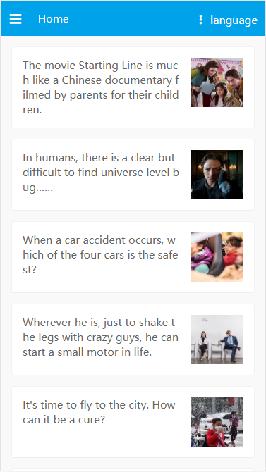

# vue-language

## 前端国际化解决方案
* vue
* vue-i18n

## 启动
```
git clone https://github.com/gabirellaq/vue-language.git
cd vue-language
npm install
npm run dev
```

### 使用详解

```
//安装
npm install vue-i18n

//引用
import Vue from 'vue'
import VueI8n from 'vue-i18n
Vue.use(VueI8n)

//创建实例
const i18n = new VueI18n({
    locale: 'zh',
    messages: {
      'zh': require('../src/lang/zh'),
      'en': require('../src/lang/en')
    }
})

//挂载实例
const app = new Vue({
    i18n
})
```

```
//在HTML模板中使用
<template>
<div>
    
    {{$t("message.title")}}
</div>
</template>

//在JS模板中使用
data() {
    return {
        title: this.$t('message.title'),
        locale: this.$i18n.locale
    }
}
```

> 语言包的写法
```
//zh.js
module.exports = {
    message: {
        title: '前端国际化解决方案'
    }
}

//en.js
module.exports = {
    message: {
        title: 'Front-end international solutions'
    }
}
```

### 难点
* 动态加载语言包([vue项目国际化vue-i18n使用](https://juejin.im/post/5aa7e18ff265da2384404334))
* 图片路径([D-i18n](https://github.com/CommanderXL/D-i18n))

### capture




### link
* [D-i18n](https://github.com/CommanderXL/D-i18n)
* [di18n-translate](https://github.com/CommanderXL/di18n-translate)
* [DDFE-blog-di18n](https://github.com/DDFE/DDFE-blog/issues/14)
* [vue项目国际化vue-i18n使用](https://juejin.im/post/5aa7e18ff265da2384404334)
